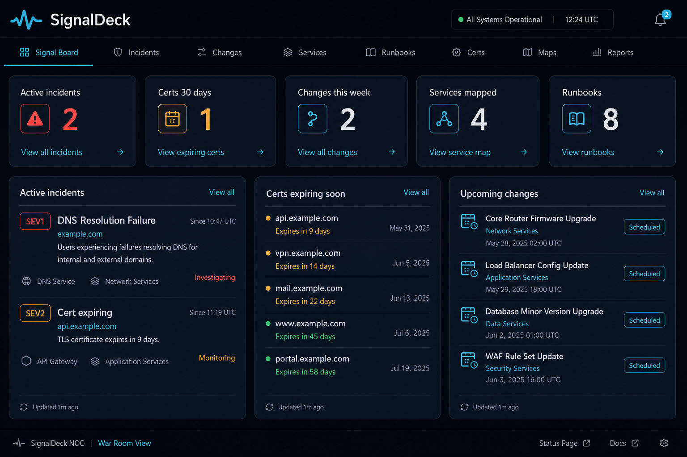
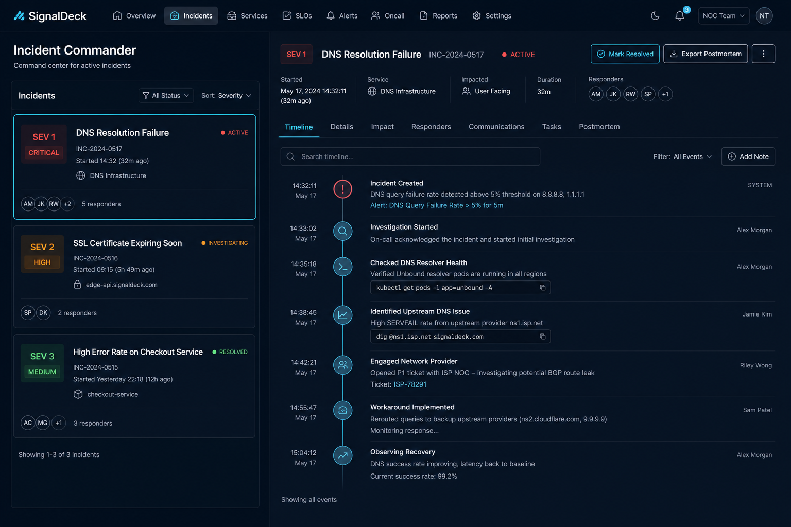
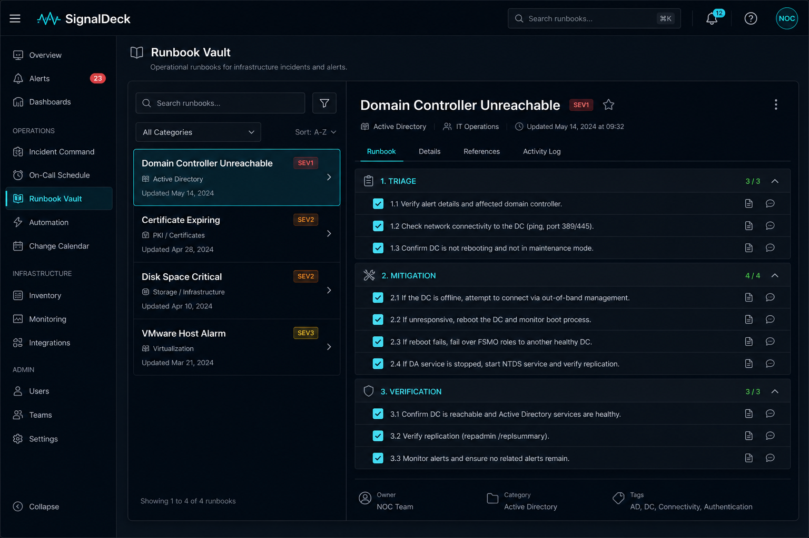
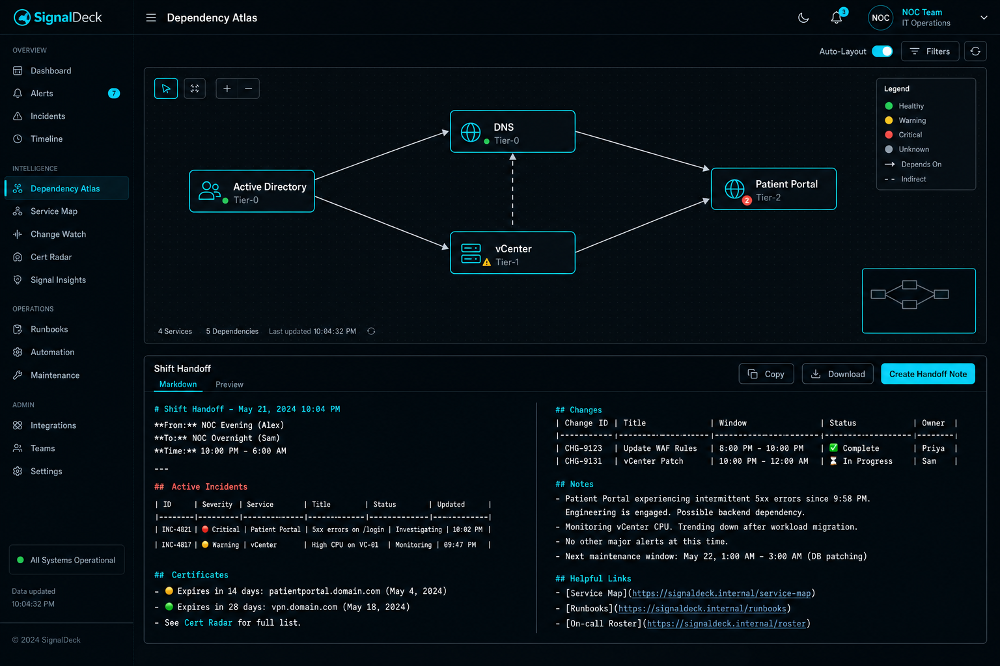

# SignalDeck

**Your team's infrastructure nerve center** — a browser-based operations war room for incident command, runbooks, cert tracking, change radar, dependency mapping, and shift handoff.

Inspired by modern AI SRE platforms (OpenSRE, HolmesGPT, Runbook Hub) but deliberately **offline-first**: no API keys, no cloud backend, no LLM required. Everything runs in the browser and stays on your machine until you export it.

Built for the **3 AM page** — when evidence is scattered across Slack, dashboards, and runbooks, SignalDeck gives your team one place to command the incident, check off procedures, and hand off cleanly.

## Screenshots

| View | Preview |
|------|---------|
| [Signal Board](#run) |  |
| [Incident Commander](#run) |  |
| [Runbook Vault](#run) |  |
| [Topology & Handoff](#run) |  |

### Signal Board

At-a-glance posture: active incidents, certs expiring, changes this week, services mapped, and runbooks ready.


### Incident Commander

Structured war room with severity, timeline, and one-click postmortem stub export.


### Runbook Vault

Eight battle-tested procedures (DC down, cert expiry, disk full, VMware alarm, DNS, patch rollback, DB pool, F5 pool) with checkbox execution tracking.


### Dependency Atlas & Shift Handoff

Map blast radius before changes. Generate markdown handoffs for Slack or Teams.


## What it does

| Module | Purpose |
|--------|---------|
| **Signal Board** | Team situational awareness — incidents, certs, changes, services |
| **Incident Commander** | Timeline, roles, resolve/export postmortem stub |
| **Runbook Vault** | Searchable runbooks with step checklists (progress saved) |
| **Dependency Atlas** | Service map with upstream/downstream blast radius |
| **Cert Watch** | Track expirations with 30/60/90-day visibility |
| **Change Radar** | Schedule maintenance windows; avoid collision during incidents |
| **Shift Handoff** | Auto-compile open incidents, cert warnings, and notes to markdown |
| **Export / Import** | Share team config as JSON via Git |

## Run

No build step. No `npm install`. Open in any modern browser via a local web server (required for runbook data loading).

### Linux

```bash
git clone <your-repo-url>
cd SignalDeck
python3 -m http.server 8080
```

Open http://localhost:8080

Or:

```bash
xdg-open http://localhost:8080
```

### Windows

```powershell
git clone <your-repo-url>
cd SignalDeck
python -m http.server 8080
```

Open http://localhost:8080

Or double-click `index.html` after starting a local server — runbooks load via `fetch()` and need HTTP, not `file://`.

### macOS

```bash
git clone <your-repo-url>
cd SignalDeck
python3 -m http.server 8080
open http://localhost:8080
```

## Team workflow

1. **Configure** — Settings tab: set team name and on-call rotation link
2. **Track** — Add certs, scheduled changes, and service dependencies
3. **Respond** — Open an incident, log timeline entries, launch a runbook
4. **Hand off** — Generate shift handoff markdown for the next engineer
5. **Share** — Export JSON to a team Git repo; teammates import to sync

## Why SignalDeck?

| Enterprise SRE tools | SignalDeck |
|---------------------|------------|
| Requires observability stack integration | Works standalone on day one |
| AI/LLM API keys and cloud costs | Zero external dependencies |
| Complex deployment (K8s, agents) | Single folder, any browser |
| Vendor lock-in | Export everything as JSON/markdown |

SignalDeck is the **human-in-the-loop command deck** your team runs while Aurora, OpenSRE, or HolmesGPT investigate in the background — or when you have no AI platform at all.

## Project structure

```
SignalDeck/
├── index.html              # Main app
├── css/styles.css          # NOC dark theme
├── js/
│   ├── app.js              # UI logic
│   └── storage.js          # localStorage persistence
├── data/
│   └── default-runbooks.json   # 8 seed runbooks
├── media/                  # README screenshots
└── README.md
```

## Security & privacy

- All data stored in **browser localStorage** only
- Nothing transmitted to external servers
- Export JSON for team backups — store in private Git
- Runbooks use generic placeholders (`example.com`) — replace with your environment

## Extending

- Add runbooks in `data/default-runbooks.json` (or via future UI)
- Fork and customize for your organization's procedures
- Pair with [AnsibleLearningLab](../AnsibleLearningLab/) for automation training
- Pair with [ServerOpsToolkit](../ServerOpsToolkit/) for Windows infra ops on the desktop

## License

MIT — use freely for your team.
